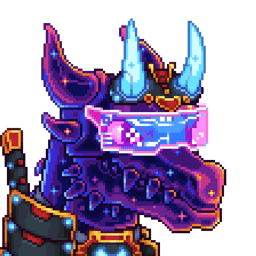
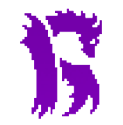
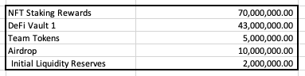
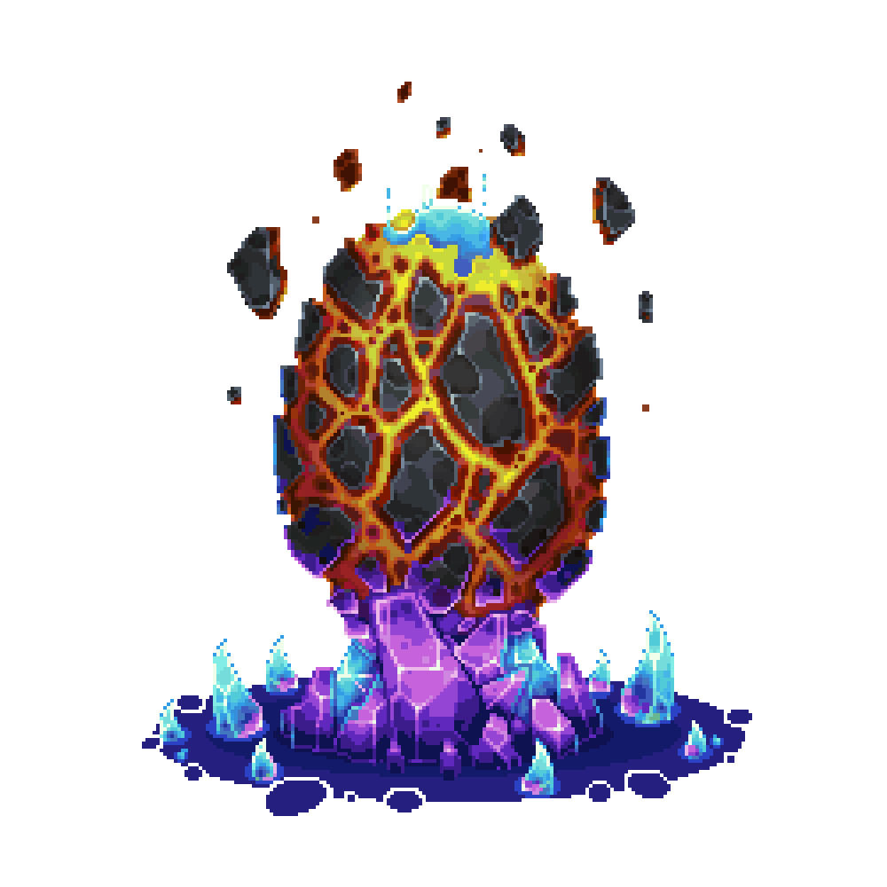
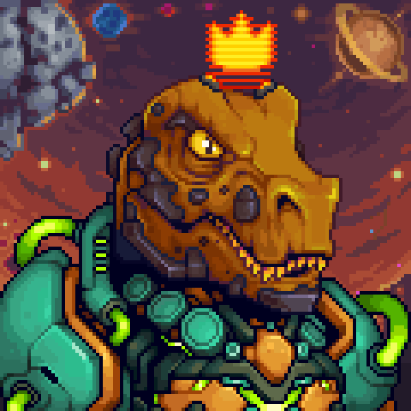

<a name="readme-top"></a>
<!-- PROJECT LOGO -->
<br />
<div align="center">
  <a href="https://github.com/YassineSMARA/ryu-front" target="_blank" >
    
  </a>

<h3 align="center">RYU Front-end</h3>

  <p align="center">
    The Source Code of the RYU Front-end
    <br />
    <br />
    <a href="https://ryunft.com" target="_blank">View Live Version</a>
    ·
    <a href="https://marketplace.kalao.io/collection/0x13d933eb47f41cbc0687376622d03a8da10feab6" target="_blank">Ryu Collection</a>
    ·
    <a href="https://marketplace.kalao.io/collection/0xa9de371071e96e2c9e3a907e5c561a6738302eb1" target="_blank">RyuGen2 Collection</a>
    ·
    <a href="https://marketplace.kalao.io/collection/0x994afdf17f6ae877986d1e6791819c36a6e12ff4" target="_blank">Ryusaur Collection</a>
  </p>
</div>

<!-- TABLE OF CONTENTS -->
<details>
  <summary>Table of Contents</summary>
  <ol>
    <li>
      <a href="#about-the-project">About The Project</a>
      <ul>
        <li><a href="#built-with">Built With</a></li>
      </ul>
      <ul>
        <li><a href="#ryu-gen1">Ryu Gen1</a></li>
      </ul>
      <ul>
        <li><a href="#nryu">$nRyu</a></li>
      </ul>
      <ul>
        <li><a href="#ryu-gen2">Ryu Gen2</a></li>
      </ul>
    </li>
    <li><a href="#how-it-was-created">How it was created</a></li>
    <li>
      <a href="#getting-started">Getting Started</a>
      <ul>
        <li><a href="#prerequisites">Prerequisites</a></li>
        <li><a href="#installation">Installation</a></li>
      </ul>
    </li>
    <li><a href="#contact">Contact</a></li>
  </ol>
</details>


<!-- ABOUT THE PROJECT -->
## About The Project

This repository contains the source code of the DAPP used by RYU.<br>
The framework used for the development is VueJS version 2.0 under typescript<br>
<p align="right">(<a href="#readme-top">back to top</a>)</p>

### Built With

<p align="left">
  <a href="https://vuejs.org/" target="_blank">
     
  </a>
  <a href="https://www.npmjs.com/" target="_blank">
     
  </a>
  <a href="https://www.typescriptlang.org/" target="_blank">
     
  </a>
</p>
<p align="right">(<a href="#readme-top">back to top</a>)</p>

<!-- Ryu Gen1 -->
## Ryu Gen1
<div align="center">
  
</div>
<br>
Ryu NFT is a collection of ERC721 tokens available on the Avalanche blockchain.<br>
This one has already realized more than 10 000 $AVAX volume.<br>

#### Tokenomics
The collection <strong>sold out</strong> at <strong>3333 NFT</strong>, the mint price was <strong>2.22 $AVAX</strong>.
<br>

#### Description
Gen1 dragons include 3234 base and 99 legendary which can breed and be staked for daily $nRyu.<br>
By staking their Ryu Gen1 users can generate $nRyu.

<a href="https://marketplace.kalao.io/collection/0x13d933eb47f41cbc0687376622d03a8da10feab6" target="_blank"> 
  🛒 Check the collection on Kalao
</a>

<p align="right">(<a href="#readme-top">back to top</a>)</p>

<!-- $nRyu -->
## $nRyu
<div align="center">
  
</div>
<br>
$nRYU is the Gen1 staking rewards token. It's an ERC20 token.<br> 

#### Tokenomics
$nRYU has a hard cap supply of <strong>130,000,000 tokens</strong>.
<div align="center">
  
</div>
<br>

#### Description
The $nRYU token can be utilized on Breeding, Potions acquisitions, Gen2 Prestige system, and more.

<a href="https://snowtrace.io/token/0x0FC468c8E2003C0e6Ab0e60DBf02b01ce27B4c7f" target="_blank"> 
  🔍 Check the token on Snowtrace
</a>

<p align="right">(<a href="#readme-top">back to top</a>)</p>

<!-- Ryu Gen2 -->
## Ryu Gen2

<div align="center">
  
</div>
<br>
RyuGen2 is a collection of ERC721 tokens available on the Avalanche blockchain.<br>
These tokens are only obtainable by breeding Ryu Gen1 tokens or by using potions from the lab.<br>

#### Tokenomics
The collection is capped at <strong>9999 NFT</strong>.
<br>

#### Description
Ryu Gen2 is the first generation of offspring in the Ryu Ecosystem. Stake these NFTs to earn $nRyu.

<a href="https://marketplace.kalao.io/collection/0xa9de371071e96e2c9e3a907e5c561a6738302eb1" target="_blank"> 
  🛒 Check the collection on Kalao
</a>


<p align="right">(<a href="#readme-top">back to top</a>)</p>

<!-- Ryusaur -->
## Ryusaur

<div align="center">
  
</div>
<br>
Ryusaurs (DINOs) were launched as a free mint on KalaoGo. Unlike most free mints from this time, this NFT bears actual utility.<br>

Ryusaurs function most similarly to the Gen2 Staking Potions, but without the expiration date.

#### Tokenomics
The collection is capped at <strong>999 NFT</strong>.
<br>

<a href="https://marketplace.kalao.io/collection/0x994afdf17f6ae877986d1e6791819c36a6e12ff4" target="_blank"> 
  🛒 Check the collection on Kalao
</a>


<p align="right">(<a href="#readme-top">back to top</a>)</p>

<!-- How it was created -->
## How it was created

I was contacted by the RYU team to create the next iteration of their roadmap which was the <a href="https://github.com/YassineSMARA/ryu-breeding-contracts" target="_blank">breeding</a> and <a href="https://github.com/YassineSMARA/ryu-staking-contract" target="_blank">staking</a> of their collection.

It was my first **big full-stack project** in blockchain, as I was alone in charge of all the parts of their creation. I was in charge of the back-end, front-end, hosting, smart-contracts creation and deployment.

For the front-end I decided to use VueJS in version **2.0** under **Typescript**.

This repository contains only the part related to the front-end. You can find the other parts on my GitHub.

### Design

As for the design, I had to work with the **RYU designer**.

He gived me a **Figma** file that i used to create the website.

I am not very comfortable with css, but I find that I am improving from project to project.

<p align="right">(<a href="#readme-top">back to top</a>)</p>

<!-- GETTING STARTED -->
## Getting Started

To get a local copy up and running follow these simple example steps.

### Prerequisites

* npm
  ```sh
  npm install npm@latest -g
  ```

### Installation

1. Clone the repo
   ```sh
   git clone https://github.com/YassineSMARA/knives-legacy-front.git
   ```
2. Install NPM packages
   ```sh
   npm install
   ```
3. Launch the app
   ```env
   npm run serve
   ```
3. Navigate to http://localhost:8080/


<p align="right">(<a href="#readme-top">back to top</a>)</p>

<!-- CONTACT -->
## Contact

Yassine SMARA <br>
Discord: Krabs#9454 <br>
Mail: 1yassine.smara@gmail.com

<p align="right">(<a href="#readme-top">back to top</a>)</p>
